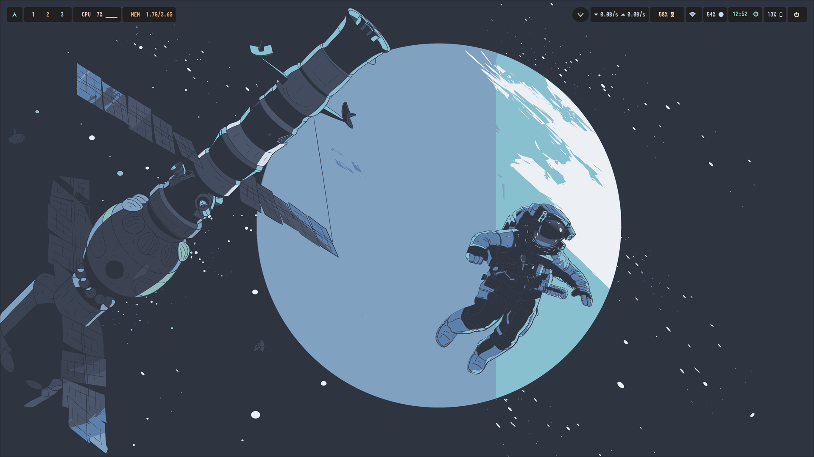
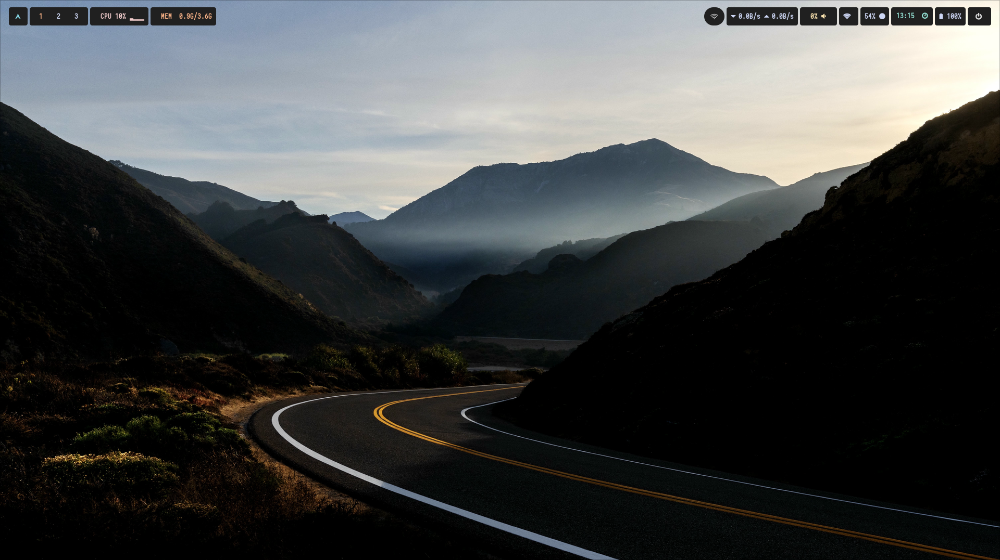
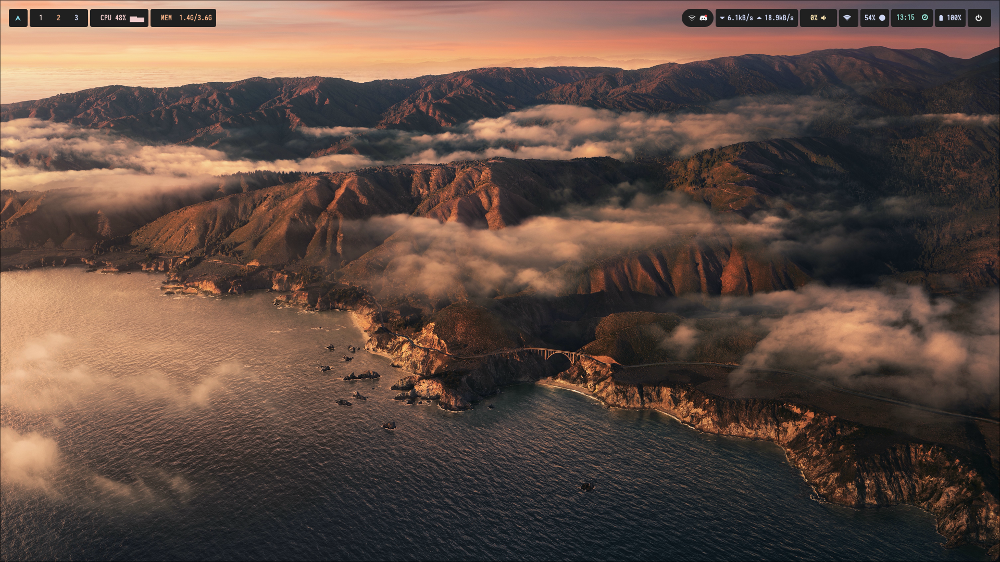
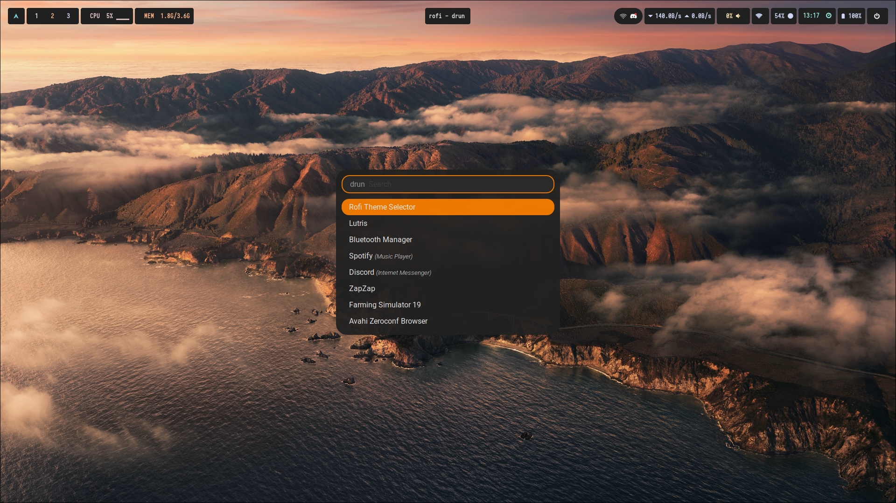
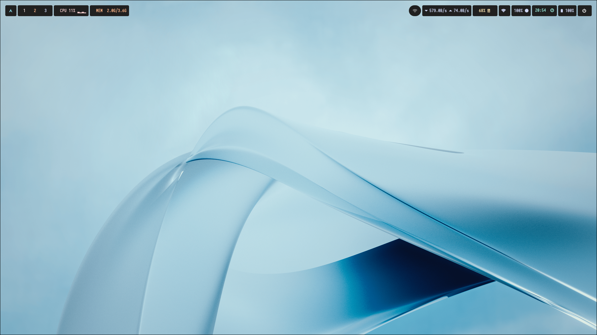
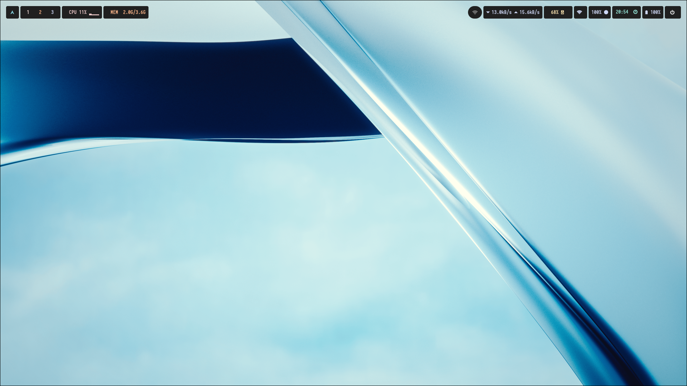

# Hyprlock Configuration – by Aditya

Note - This Hyprland Configuration is way more clean and minimal now and im soon thinkin to update the configuration in a new branch called - NewHyprDots

This is my personal configuration for [Hyprland](hyprland.org).

## 🔐 Features

- Clean, minimal layout
- Minimal Waybar Config
- Clean Animations
- 10+ animations sets for hyprland
- Integrated lock animation and styling
- Power usage and battery indicators
- Some custom scripts included for system lock via keybinds

- By the way this hyprlock white color wallaper and in the new config wallapers are paid i got em for free (just for you)

## Binds -
- Close App -- Super + C
- Open Rofi -- Super + Space
- Open Terminal -- Super + Enter
- Open File Explorer -- Super + E
- Open Browser -- Super + B
- Open Wallpaper Switcher -- Super + W
- Set Lock Screen Wallpaper -- Alt + W  (It sets the current wallpaper to lock screen wallpaper)
- Take Screenshot -- Super + D
- Move Focus -- Super + Left,Right,Up,Down
- Change Workspaces -- Super + 1,2,3,4,5,6,7,8,9,0
- Move Window to a Workspace -- Super + Shift + 1,2,3,4,5,6,7,8,9,0
- Fullscreen Any Window -- Super + F
- Toggle Split -- Super + J
- Reload Waybar -- Super + R
- Lock Screen -- Super + L
- Logout Menu -- Super + H
- Toggle Floating + Super + V
- Pseudo -- Super + P
- Force Exit Hyprland -- Super + M

## 📸 Lock Screen (New)

> 

### Old








### New


```bash
Not everyconfig here is mine waybar,rofi and nvim configs are taken from the internet (I will credit the Actual Devs Soon I cant find em Sorry Devs, But i will soon)
```
>Credits For Waybar and Rofi Configs:


