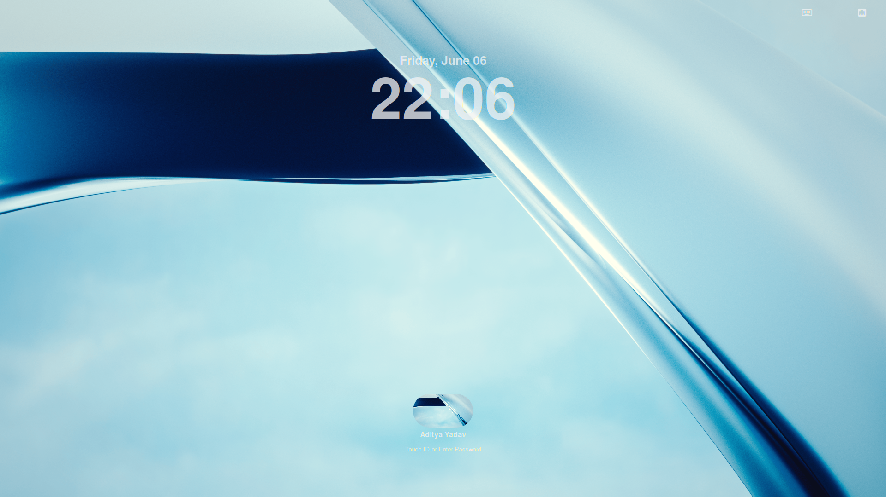
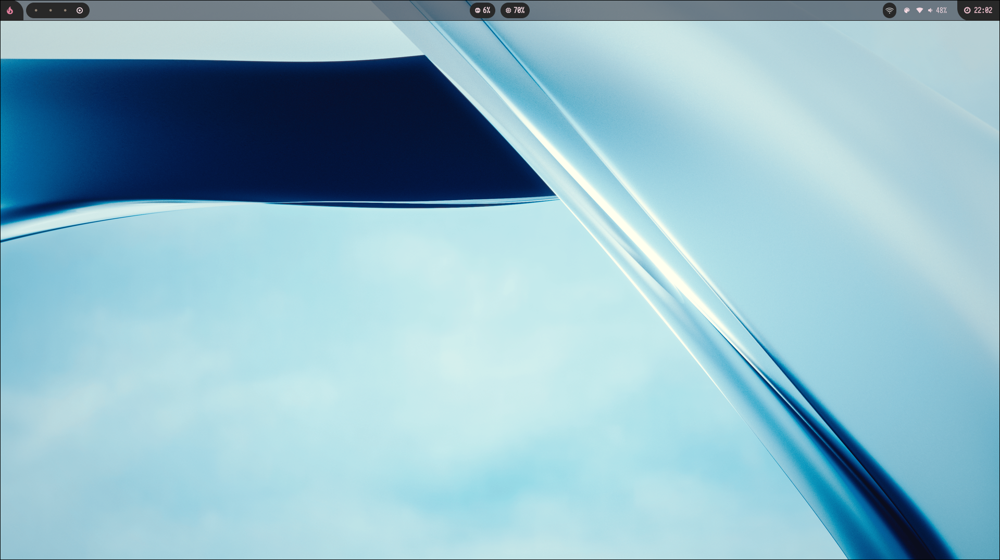
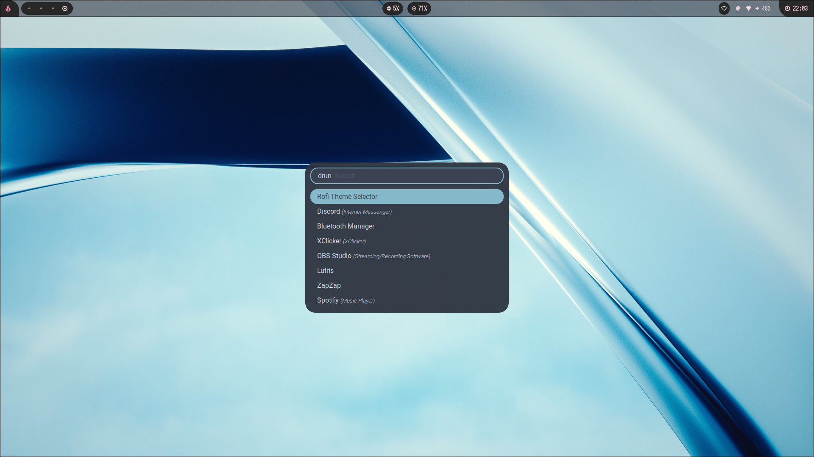

# Hyprland Configuration – by **Zepyx**

> **Notice:**  
> This project is no longer actively maintained. For the latest configuration updates and continued support, please refer to [HyprZepyx](https://github.com/xZepyx/HyprZepyx).

This repository contains my personal configuration for [Hyprland](https://hyprland.org), designed for a clean and minimal desktop experience with enhanced productivity features.

---

## Features

- **Clean, Minimal Layout:** Focused on simplicity and clarity.
- **Minimal Waybar Config:** Lightweight status bar with essential modules.
- **Smooth Animations:** Over 10 unique animation sets for a polished look.
- **Integrated Lock Animations & Styling:** Custom lock screen animation and theming.
- **Power Usage & Battery Indicators:** Stay informed about your system's status.
- **Custom Scripts:** Handy scripts for system lock, workspace management, and more.

---

## Keybindings

| Action                         | Key Combination               |
|---------------------------------|-------------------------------|
| Close App                      | `Super + C`                   |
| Open Rofi                      | `Super + Space`               |
| Open Terminal                  | `Super + Enter`               |
| Open File Explorer             | `Super + E`                   |
| Open Browser                   | `Super + B`                   |
| Open Wallpaper Switcher        | `Super + W`                   |
| Set Lock Screen Wallpaper      | `Alt + W`                     |
| Take Screenshot                | `Super + D`                   |
| Move Focus                     | `Super + Arrow Keys`          |
| Change Workspaces              | `Super + 1..0`                |
| Move Window to Workspace       | `Super + Shift + 1..0`        |
| Fullscreen Window              | `Super + F`                   |
| Toggle Split                   | `Super + J`                   |
| Reload Waybar                  | `Super + R`                   |
| Lock Screen                    | `Super + L`                   |
| Logout Menu                    | `Super + H`                   |
| Toggle Floating                | `Super + V`                   |
| Toggle Pseudo Tile             | `Super + P`                   |
| Force Exit Hyprland            | `Super + M`                   |

---

## Installation

**Automated (use with caution):**
```bash
curl -s https://raw.githubusercontent.com/xZepyx/Hyprland-Configuration/main/install.sh | bash
```

**Manual:**
1. Clone the repository:
    ```bash
    git clone https://github.com/Aditya8912S/Hyprland-Configuration.git
    cd Hyprland-Configuration
    ```
2. Make the install script executable:
    ```bash
    chmod +x install.sh
    ```
3. Run the script:
    ```bash
    ./install.sh
    ```

*If you encounter any issues with the script, please ensure you have the necessary permissions or run as superuser.*

---

## Screenshots

### Lock Screen (New)


### Desktop (New)



---

## Credits

- **Waybar Config:**  
  Based on [linuxmobile/hyprland-dots](https://github.com/linuxmobile/hyprland-dots)

- **Rofi Themes:**  
  From [newmanls/rofi-themes-collection](https://github.com/newmanls/rofi-themes-collection)

---

Feel free to fork or use parts of this configuration for your own setup!
